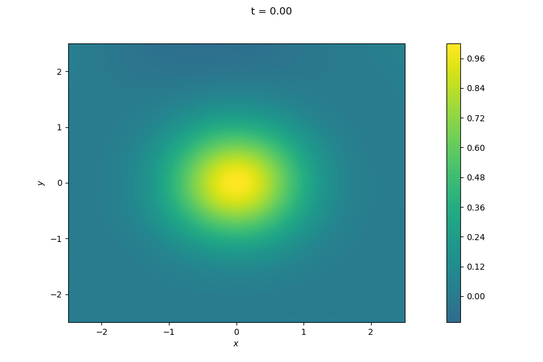
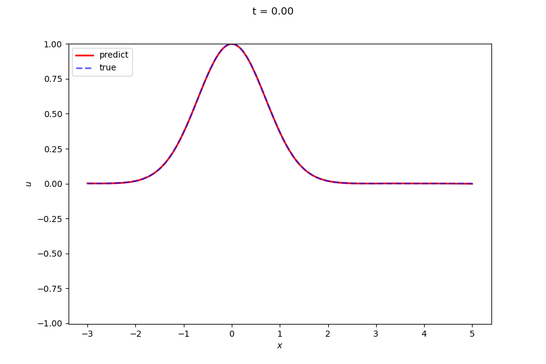

# PINN for wave equation

Using PINN to solve the wave equation by boundary and initial conditions.

See also: [Physics-informed Neural Networks (PINNs) for Wave Propagation and Full Waveform Inversions](https://arxiv.org/abs/2108.12035)

The different descriptions refers to the different loss functions and the different models.

For futher instructions, plase see the demo ([jupyter notebook](./demo/demo.ipynb))

## Example

## Contact me
zhengcf@mail.bnu.edu.cn
